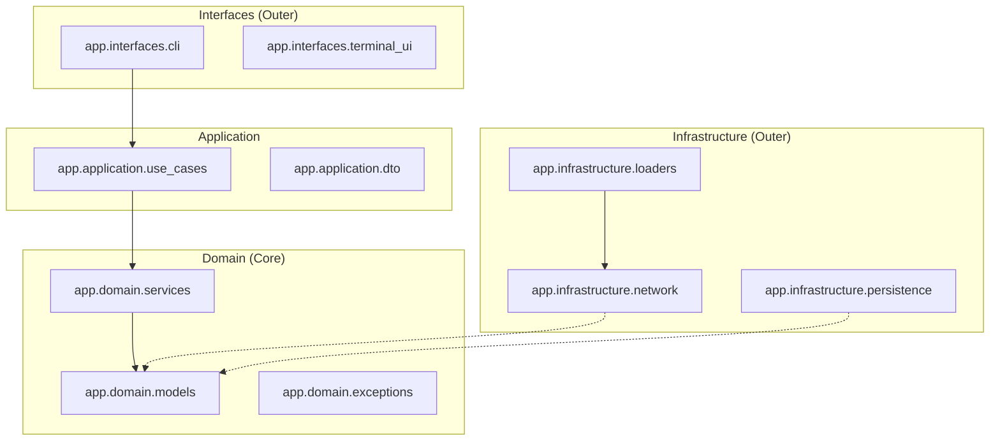
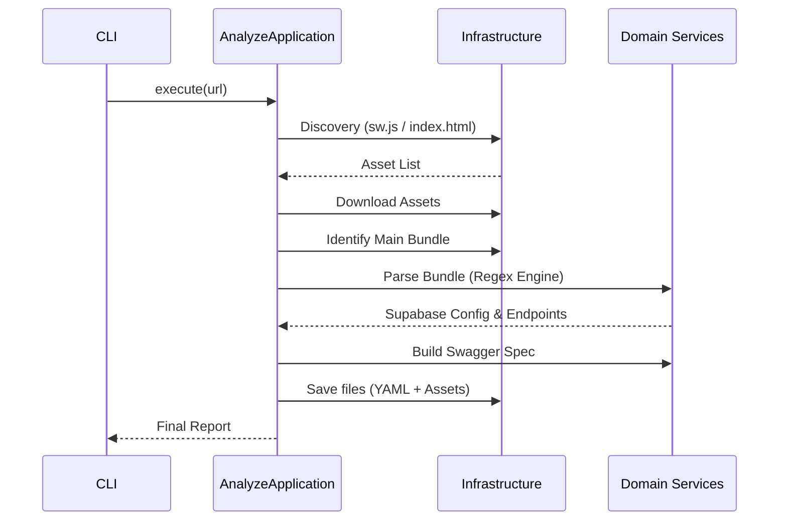

# Arquitetura Técnica: Chupabase Analyzer Engine

Este documento detalha a arquitetura de software do Chupabase Analyzer, fundamentada em **Clean Architecture** e **Domain-Driven Design (DDD)**. O sistema foi projetado para ser resiliente, testável e desacoplado de bibliotecas externas.

---

## 🏗️ Visão Geral das Camadas

A estrutura segue a regra de dependência: **as camadas externas dependem das internas, mas as internas nunca conhecem as externas.**



### 1. Camada de Domínio (Domain)
O **Coração da Aplicação**. Contém a lógica de negócio pura e as definições de dados (Entidades e Value Objects).
- **`models/`**: Representações de `Asset`, `Endpoint` e `SupabaseConfig`.
- **`services/`**: Lógica algorítmica de parsing (`BundleParserService`) e transformação de contratos (`SwaggerBuilderService`).
- **`exceptions.py`**: Definições de erros específicos do domínio que interrompem o fluxo de negócio.

### 2. Camada de Aplicação (Application)
Orquestra o fluxo de dados e implementa os **Casos de Uso**.
- **`use_cases/`**: 
    - `AnalyzeApplication`: Coordena o pipeline de descoberta e extração.
    - `ApiReliabilityTester`: Realiza auditoria de acessibilidade nos endpoints mapeados.
- **`dto/`**: Objetos de transferência (`AnalysisReport`) que isolam o domínio da camada de apresentação.

### 3. Camada de Infraestrutura (Infrastructure)
Implementações concretas de I/O, rede e persistência.
- **`network/`**: `HTTPClient` resiliente com políticas de retry e timeouts configuráveis.
- **`persistence/`**: `FileRepository` responsável pela gestão física de diretórios e arquivos.
- **`loaders/`**: `AssetDownloader` especializado na ingestão em massa de recursos estáticos.

### 4. Camada de Interface (Interfaces)
Ponto de entrada do usuário e telemetria visual.
- **`cli/`**: Gestão de argumentos e UX via biblioteca **Rich**.
- **`main.py`**: Realiza a **Injeção de Dependências** manual e inicializa o sistema.

---

## 🔄 Pipeline de Processamento

O ciclo de vida de uma análise segue um fluxo determinístico:



---

## 🛡️ Qualidade e Confiabilidade

### Estratégia de Testes
O projeto mantém **100% de cobertura de código** via `pytest`.
- **Testes Unitários**: Isolam cada serviço e modelo utilizando mocks para infraestrutura.
- **Injeção de Dependência**: O uso de injeção manual permite substituir o `HTTPClient` por mocks em memória, garantindo que os testes não dependam de conectividade externa.

### Tratamento de Erros de Fluxo
1. **Domínio**: Lança `DomainError` para falhas lógicas (ex: anonKey não encontrada).
2. **Infraestrutura**: Trata exceções de rede e I/O, reportando ao log mas permitindo a continuidade do loop quando possível (ex: falha no download de um único asset irrelevante).

### Hooks de Qualidade (Pre-commit)
- **Ruff**: Enforce de estilo e linting.
- **Bandit**: Análise estática de segurança.
- **Interrogate**: Garante que 100% das classes e métodos possuam docstrings.
- **Coverage**: Bloqueia commits que reduzam a cobertura global abaixo de 100%.

---

## 📁 Layout de Diretórios

```text
src/
└── app/
    ├── domain/            # Regras Puras (Pydantic-like models)
    ├── application/       # Orquestração (Use Cases & DTOs)
    ├── infrastructure/    # Adaptadores Externos (Requests, Pathlib)
    └── interfaces/        # Apresentação (CLI, Terminal UI)
```