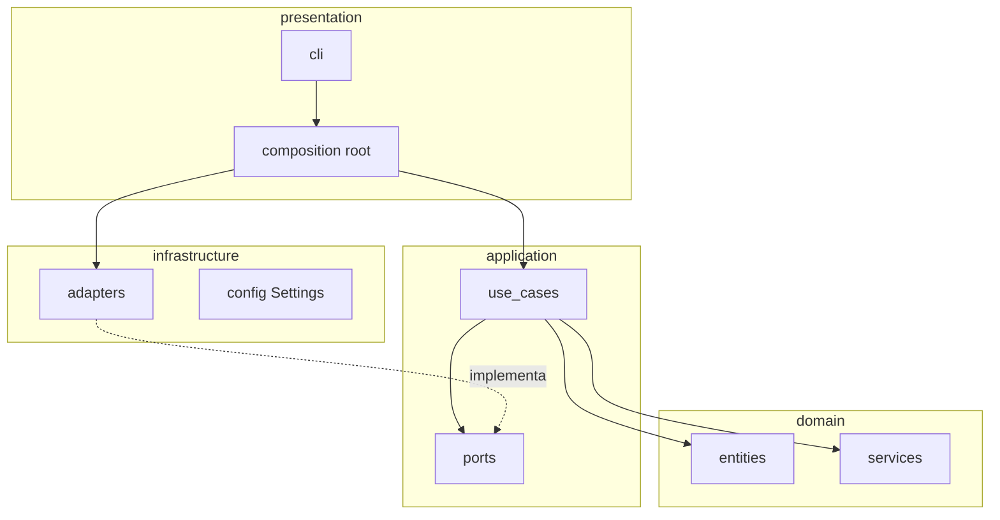

# Arquitetura Tecnica: Supabase Recon Analyzer

Arquitetura baseada em **Clean Architecture / Hexagonal** e **Domain-Driven Design (DDD)**.

## Camadas

```mermaid
flowchart TB
  subgraph presentation [presentation]
    CLI[cli]
    Root[composition root]
  end
  subgraph application [application]
    UC[use_cases]
    Ports[ports]
  end
  subgraph domain [domain]
    Ent[entities]
    Svc[services]
  end
  subgraph infrastructure [infrastructure]
    Adapters[adapters]
    Cfg[config Settings]
  end
  CLI --> Root
  Root --> UC
  Root --> Adapters
  UC --> Ports
  UC --> Ent
  UC --> Svc
  Adapters -.->|implementa| Ports
```

### Domain

Entidades (`Asset`, `Endpoint`, `SupabaseConfig`), services (`BundleParserService`, `SwaggerBuilderService`), validacao e excecoes. Sem IO e sem logs.

### Application

Use cases (`AnalyzeApplication`, `ApiReliabilityTester`), DTOs e **ports** (`HttpClientPort`, `FileRepositoryPort`, `AssetDownloaderPort`).

### Infrastructure

Adapters HTTP/disco/download, `Settings` via `.env`, `log_event` semantico.

### Presentation

CLI (argumentos + Rich UI), setup de logging e **composition root** em `presentation/cli/bootstrap.py`.

## Pipeline

1. Bootstrap carrega Settings e instancia adapters + use cases.
2. Discovery de assets (`sw.js` ou `index.html`).
3. Download e identificacao do bundle JS principal.
4. Parsing de config Supabase e endpoints.
5. Geracao de OpenAPI (`swagger.yaml`).
6. Opcional: testes de confiabilidade com `anon_key`.

## Configuracao

Via `.env` na raiz (ver `.env.example`): timeout HTTP, diretorio de saida, nivel de log. Testes isolam dotenv com `RECON_DISABLE_DOTENV=1`.

## Qualidade

Cobertura 100% com branch coverage, mypy strict, Ruff, vulture, bandit, pip-audit, gate de imports entre camadas. Detalhes em `docs/engineering-python.md` e `docs/structure.md`.
